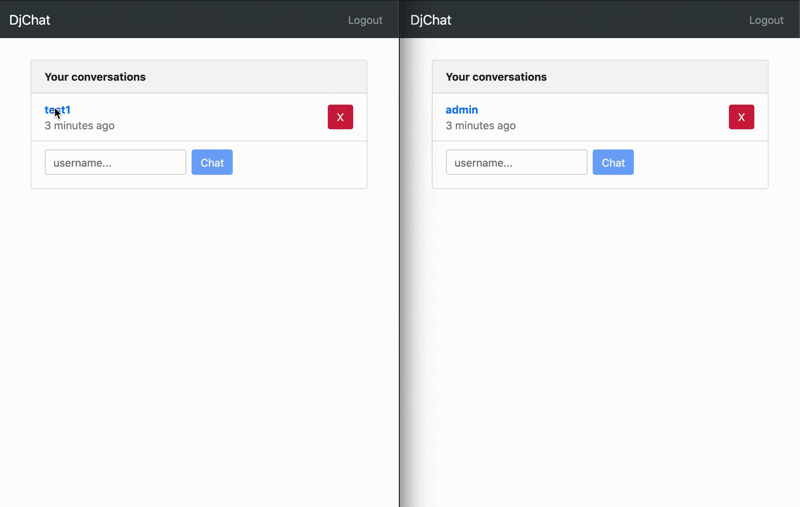

# DjChat

A simple direct messaging application built with Django, Django Channels, React hooks, Redux toolkit and Redis.

Includes:

- User authentication and accounts
- Persistent messaging (messages stored in db)

## Demo

